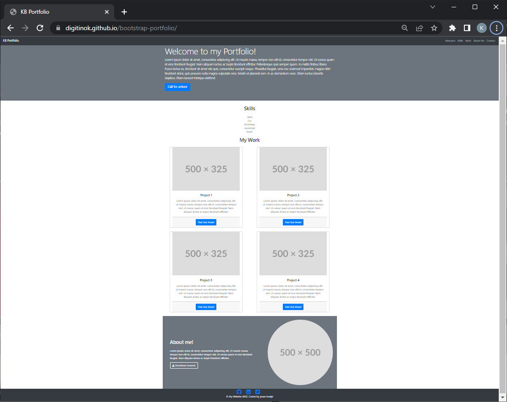
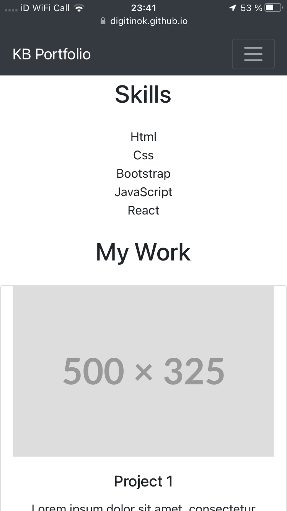

# Bootstrap Portfolio

## Description

The aim fo this project is to create a portfolio page of all my coding project to make them accessible to other people and showcase my capabilities using Bootstrap.

### Repository

https://github.com/digitinok/bootstrap-portfolio

### Deployed Page

https://digitinok.github.io/bootstrap-portfolio/

## Installation

n/a

## Usage

This is how the deployed page looks like on a desktop and a mobile:

Desktop version of portfolio

Mobile version of portfolio

## Credits

N/A

## License

This project uses the MIT License. Please see the license file in the repositiry for fursther details.